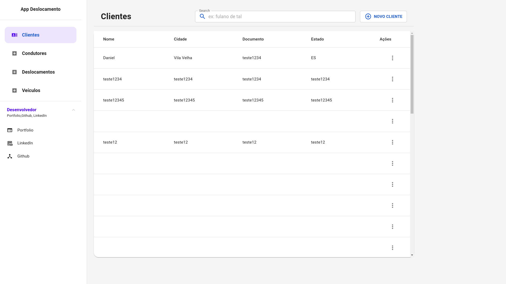
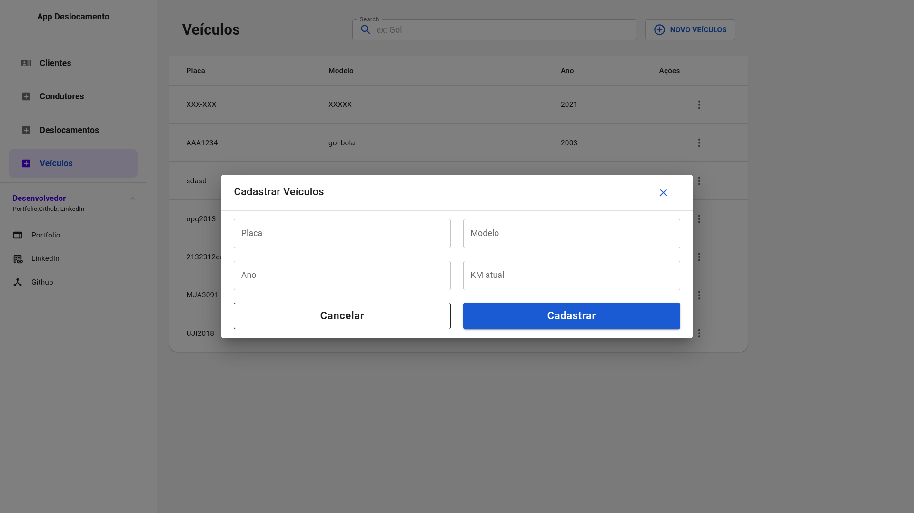

<h1 align="center">
    🏍️ <a href="#" alt="site do ecoleta"> App Deslocamento </a>
</h1>

 
<h4 align="center">
	🚧 Concluído 🚀 🚧
</h4>


[](https://www.linkedin.com/in/jonas-martins-950a30184/)

Tabela de conteúdos
=================
<!--ts-->
- [Tabela de conteúdos](#tabela-de-conteúdos)
  - [💻 Sobre o projeto](#-sobre-o-projeto)
  - [Funcionalidades](#funcionalidades)
  - [🎨 Layout](#-layout)
    - [Web](#web)
  - [🚀 Como executar o projeto](#-como-executar-o-projeto)
    - [Pré-requisitos](#pré-requisitos)
    - [🎲 Rodando o Front End](#-rodando-o-front-end)
  - [🛠 Tecnologias](#-tecnologias)
  - [📝 Licença](#-licença)
<!--te-->

---

## 💻 Sobre o projeto

   🏍️ App Deslocamento - Desenvolver uma aplicação front-end utilizando ReactJS com TypeScript, utilizando o framework Next.js e a biblioteca Material-UI, que permita aos usuários interagir com a API Deslocamento para realizar operações relacionadas a clientes, condutores, deslocamentos e veículos. A aplicação deve fornecer interfaces para criar, visualizar, atualizar e excluir registros em cada uma dessas entidades, seguindo as melhores práticas e padrões de desenvolvimento.


## Funcionalidades

- [x] Funcionalidade;
- [x] Qualidade do Código;
- [x] Usabilidade da Interface;
- [x] Integração com a API:;
- [x] Cumprimento dos Requisitos;

---

## 🎨 Layout


### Web

<p align="center" style="display: flex; align-items: flex-start; justify-content: center;">
  

  
</p>

---

## 🚀 Como executar o projeto

💡O Frontend recisa que o Backend esteja sendo executado para funcionar.


### Pré-requisitos

Antes de começar, você vai precisar ter instalado em sua máquina as seguintes ferramentas:
[Git](https://git-scm.com), [Node.js](https://nodejs.org/en/). 
Além disto é bom ter um editor para trabalhar com o código como [VSCode](https://code.visualstudio.com/)


### 🎲 Rodando o Front End

```bash
# Clone este repositório
$ git clone <https://github.com/jonasmartinsdev/deslocamento.git>

# Acesse a pasta do projeto no terminal/cmd
$ cd deslocamento

# Renomeie o .env.example para .env.local

# Instale as dependências
$ npm install

# Execute a aplicação em modo de desenvolvimento
$ npm run dev

```

---

## 🛠 Tecnologias

Esse projeto foi desenvolvido com as seguintes tecnologias:

- Material Ui
- Formik
- React Redux
- Next.js
- TypeScript

---

## 📝 Licença

Este projeto esta sobe a licença [MIT](./LICENSE).

Feito com ❤️ por Jonas Martins 👋🏽 [Entre em contato!](https://www.linkedin.com/in/jonas-martins-950a30184)

---


<!-- ##  Versões do README

[Português 🇧🇷](./README.md) -->
